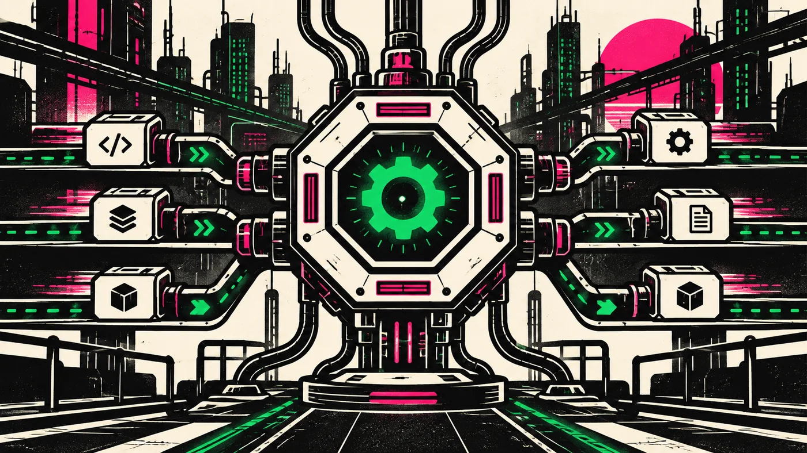
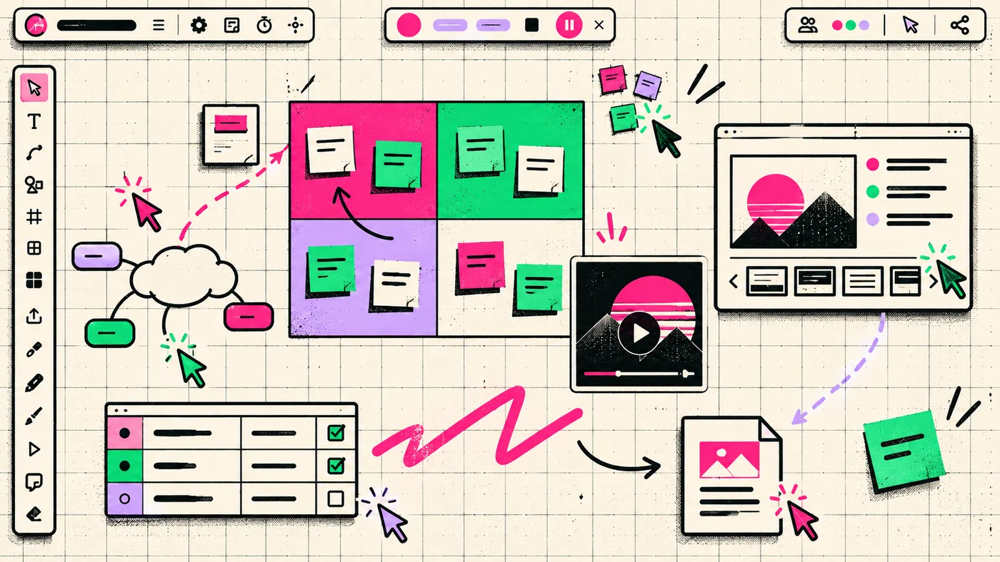


██████╗░██████╗░░█████╗░░░░░░██╗███████╗░█████╗░████████╗░██████╗
██╔══██╗██╔══██╗██╔══██╗░░░░░██║██╔════╝██╔══██╗╚══██╔══╝██╔════╝
██████╔╝██████╔╝██║░░██║░░░░░██║█████╗░░██║░░╚═╝░░░██║░░░╚█████╗░
██╔═══╝░██╔══██╗██║░░██║██╗░░██║██╔══╝░░██║░░██╗░░░██║░░░░╚═══██╗
██║░░░░░██║░░██║╚█████╔╝╚█████╔╝███████╗╚█████╔╝░░░██║░░░██████╔╝
╚═╝░░░░░╚═╝░░╚═╝░╚════╝░░╚════╝░╚══════╝░╚════╝░░░░╚═╝░░░╚═════╝░


Sometimes I find a little time and write code. These are the projects where
curiosity turned into something useful.

<section class="project-list" aria-label="Selected projects">
  <article class="project-card">
    

      
    

    

      01
      
Build automation

      <h2>Octa</h2>
      

        A fast, plugin-driven task runner and build tool written in Rust. Octa
        reads declarative YAML task files, resolves dependencies and includes,
        and runs independent work in parallel.
      

      <ul class="project-card__stack" aria-label="Octa technologies">
        <li>Rust</li>
        <li>YAML</li>
        <li>Plugins</li>
      </ul>
      <nav class="project-card__links" aria-label="Octa links">
        <a href="https://github.com/OctaHive/octa">Source code ↗</a>
        <a href="https://github.com/OctaHive/octa/releases">Releases ↗</a>
      </nav>
    

  </article>

  <article class="project-card">
    

      
    

    

      02
      
Task scheduler

      <h2>Octabot</h2>
      

        A plugin-based scheduler and automation service. It stores projects and
        recurring jobs in SQLite, exposes a REST API, and executes extensions as
        sandboxed WebAssembly components.
      

      <ul class="project-card__stack" aria-label="Octabot technologies">
        <li>Rust</li>
        <li>WebAssembly</li>
        <li>SQLite</li>
      </ul>
      <nav class="project-card__links" aria-label="Octabot links">
        <a href="https://github.com/OctaHive/octabot">Source code ↗</a>
        <a href="https://github.com/OctaHive/octabot#setup">Setup guide ↗</a>
      </nav>
    

  </article>

  <article class="project-card">
    

      
    

    

      03
      
Visual collaboration

      <h2>Nezumo</h2>
      

        An open collaborative workspace built around an infinite canvas for
        planning, workshops, and presentations. It combines real-time editing,
        browser and desktop clients, rich media, and board export.
      

      <ul class="project-card__stack" aria-label="Nezumo technologies">
        <li>Rust</li>
        <li>React</li>
        <li>WebAssembly</li>
      </ul>
      <nav class="project-card__links" aria-label="Nezumo links">
        <a href="https://nezumo.ru">Website ↗</a>
        <a href="https://app.nezumo.ru">Open app ↗</a>
        <a href="https://github.com/OctaHive/nezumo">Source code ↗</a>
      </nav>
    

  </article>
</section>
