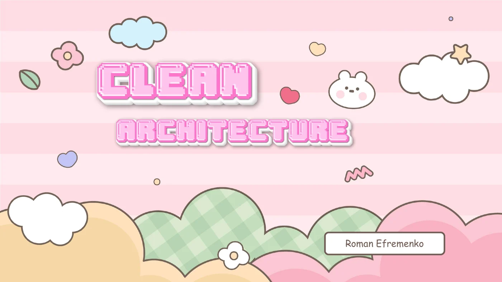


████████╗░█████╗░██╗░░░░░██╗░░██╗░██████╗
╚══██╔══╝██╔══██╗██║░░░░░██║░██╔╝██╔════╝
░░░██║░░░███████║██║░░░░░█████═╝░╚█████╗░
░░░██║░░░██╔══██║██║░░░░░██╔═██╗░░╚═══██╗
░░░██║░░░██║░░██║███████╗██║░╚██╗██████╔╝
░░░╚═╝░░░╚═╝░░╚═╝╚══════╝╚═╝░░╚═╝╚═════╝░


A collection of slides from my talks. Open a deck in the browser or download
the original PDF.

<section class="project-list" aria-label="Presentation slides">
  <article class="project-card">
    

      
    

    

      01
      
Software architecture · 53 slides

      <h2>Clean Architecture</h2>
      

        A practical tour of software modularity: coupling and cohesion, the path
        from layered and hexagonal designs to Clean Architecture, and the roles
        of domain objects, use cases, ports, repositories, and bounded contexts.
      

      <ul class="project-card__stack" aria-label="Clean Architecture topics">
        <li>Architecture</li>
        <li>DDD</li>
        <li>CQRS</li>
      </ul>
      <nav class="project-card__links" aria-label="Clean Architecture presentation links">
        <a href="clean-architecture.pdf" target="_blank" rel="noopener">View slides ↗</a>
        <a href="clean-architecture.pdf" download>Download PDF ↓</a>
      </nav>
    

  </article>

  <article class="project-card">
    

      
    

    

      02
      
WebAssembly · 32 slides

      <h2>Heroes of Modularity</h2>
      

        An exploration of cross-platform plugin systems with low overhead and
        strong isolation. The talk compares scripting, IPC, and dynamic
        libraries before moving into WebAssembly, WASI, WIT, and components.
      

      <ul class="project-card__stack" aria-label="Heroes of Modularity topics">
        <li>WebAssembly</li>
        <li>WASI</li>
        <li>Plugins</li>
      </ul>
      <nav class="project-card__links" aria-label="Heroes of Modularity presentation links">
        <a href="webassembly-plugins.pdf" target="_blank" rel="noopener">View slides ↗</a>
        <a href="webassembly-plugins.pdf" download>Download PDF ↓</a>
      </nav>
    

  </article>
</section>
